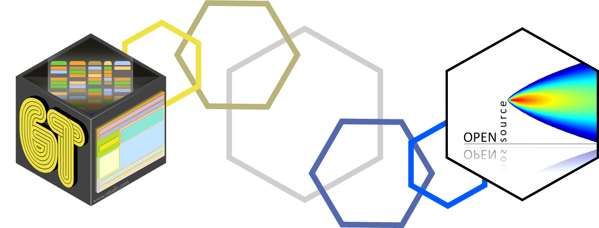
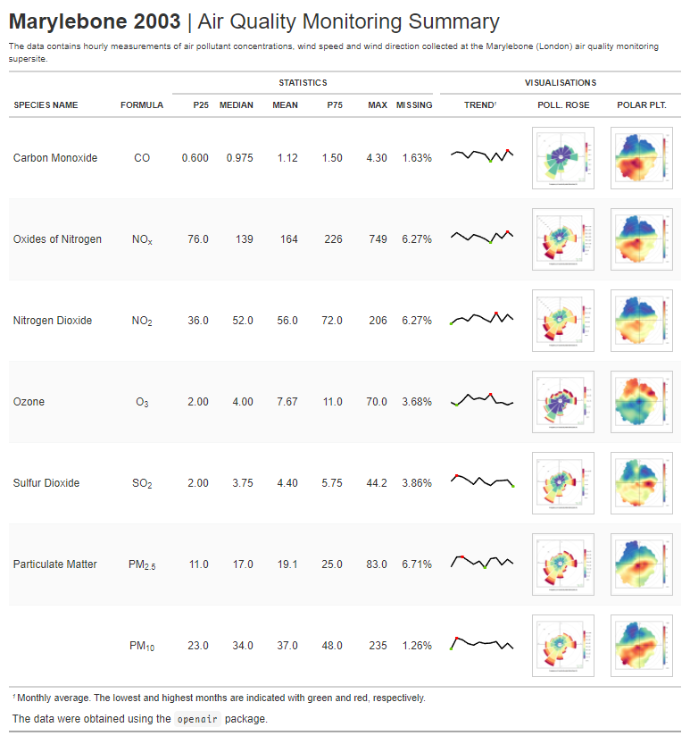

<a href="https://rpubs.com/JackDavison/gt-openair">

</a>
<h2 align="center">
 RStudio Table Contest 2021: <a href="https://www.rstudio.com/blog/winners-of-the-2021-table-contest/">Honourable Mention</a> Recipient
</h2>

<h1 style="font-weight:normal" align="center">
 "Using <code>gt</code>, <code>gtExtras</code> and <code>openair</code> to present air quality monitoring data"
</h1>

<b><a href="https://jack-davison.quarto.pub/gt-openair">[Click to View 2022 Tutorial Update]</a></b>

<a href="https://rpubs.com/JackDavison/gt-openair/">[Original Submission]</a>

## 📝 The Table
 

  
Click to view

  
 The table is best viewed <a href="https://rpubs.com/JackDavison/gt-openair">[here]</a> to "zoom in" on the <code>openair</code> plots! 
  <a href="https://rpubs.com/JackDavison/gt-openair">
</a>

## 👨‍🏫 The Tutorial
 
The tutorial, presented using `rmarkdown`, is an introduction to the `gt` package for an air quality professional already fairly comfortable with `R`, the `tidyverse` and `openair`. My approach when writing the tutorial was threefold:

 1.  I wanted to present `gt` (the unfamiliar) in analogue to `ggplot2` (the familiar).
 2.  I wanted to "stage" the tutorial such that learners could drop off mid-way if desired.
 3.  I wanted to present the most relevant and useful elements of `gt` for presenting air quality data specifically in an attractive and engaging way.
 
 On point 2, I chose to present this very apparently, splitting the tutorial into three sections which build on one another. Each section uses `rmarkdown` tabs to split the section up into, _a)_, a mini-tutorial which guides the reader through the content, _b)_, a code block which reproduces the entire table from scratch and, _c)_, the table that is being created in that section. This ensures that more confident readers can quickly assess which level they would like to read to.
 
 One of the key challenges of writing this was combining `openair` - a commonly used, industry-standard visualisation package self-described as a product of its time - with `gt` - a more modern tabulation tool. The key source of friction was inserting `lattice`-based `openair` plots into a `gt` HTML table, as `gt` only really streamlines the insertion of `ggplot2` figures. This is sensible - `ggplot2` has become the default tool for plotting in R - but in these fringe cases it can be useful to know how to marry the old and new.
 
## 🗃️ The Repository

This repository is somewhat spartan, but the following files may be of interest:

1.  [R/create-full-table.R](./R/create-full-table.R) - This is a .R file that just contains the code to crate the HTML table. No external data is required for this.
2.  [rmd/table-contest-rmd.Rmd](./rmd/table-contest-rmd.Rmd) - This is the raw .Rmd file that knits to create the tutorial.
3.  [qmd/table-contest-qmd.qmd](./qmd/table-contest-qmd.qmd) - This is the raw .qmd file of the 2022 update of the tutorial, which uses Quarto.
4.  [man/final-table.png](./man/final-table.png) - This is a static image of the final HTML table.
 
## 👋 About the Author
**I am an R Developer and Data Analyst, having recently completed a PhD in atmospheric chemistry at the [Wolfson Atmospheric Chemistry Laboratories](https://www.york.ac.uk/chemistry/research/wacl/) at the [University of York](https://www.york.ac.uk/) in the United Kingdom, investigating how emissions from road transport impact the air we breathe.** I accomplish much of my work through using [R](https://www.r-project.org/) in the [RStudio](https://rstudio.com/) IDE, with a focus on the [`{tidyverse}`](https://www.tidyverse.org/) suite of R packages and the dedicated air quality analysis package [`{openair}`](https://davidcarslaw.github.io/openair). I'm also keen on teaching reproducible data analysis through R, having become an [Rstudio Certified Tidyverse Instructor](https://education.rstudio.com/trainers/) in 2021.

 &nbsp;&nbsp;&nbsp;🐤 <a href="https://twitter.com/JDavison_">Twitter<a>&nbsp;&nbsp;&nbsp;
 •
 &nbsp;&nbsp;&nbsp;💼 <a href="https://www.linkedin.com/in/jack-davison/">LinkedIn<a>&nbsp;&nbsp;&nbsp;
 •
 &nbsp;&nbsp;&nbsp;✍🏼 <a href="https://jack-davison.github.io/">Blog<a>&nbsp;&nbsp;&nbsp;
 •
 &nbsp;&nbsp;&nbsp; <a href="https://orcid.org/0000-0003-2653-6615/">ORCID<a>&nbsp;&nbsp;&nbsp;

