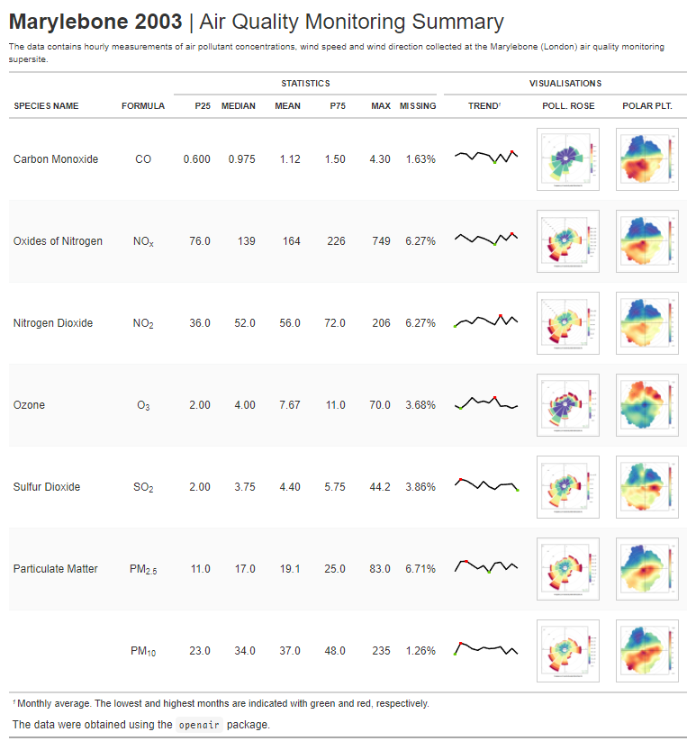

<h2 style="font-weight:bold" align="center">
 RStudio Table Contest 2021: Tutorial Submission
</h2>

<h1 style="font-weight:normal" align="center">
 "Using <code>gt</code>, <code>gtExtras</code> and <code>openair</code> to present air quality monitoring data"
</h1>

 &nbsp;&nbsp;&nbsp;🐤 <a href="https://twitter.com/JDavison_">Twitter<a>&nbsp;&nbsp;&nbsp;
 •
 &nbsp;&nbsp;&nbsp;💼 <a href="https://www.linkedin.com/in/jack-davison/">LinkedIn<a>&nbsp;&nbsp;&nbsp;
 •
 &nbsp;&nbsp;&nbsp;✍🏼 <a href="https://jack-davison.github.io/">Blog<a>&nbsp;&nbsp;&nbsp;
 •
 &nbsp;&nbsp;&nbsp; <a href="https://orcid.org/0000-0003-2653-6615/">ORCID<a>&nbsp;&nbsp;&nbsp;

## 📝 The Table
 

  
Click to view

  
 The table is best viewed here to "zoom in" on the <code>openair</code> plots! 
  

## 👨‍🏫 The Tutorial
 
The tutorial, presented using `rmarkdown`, is an introduction to the `gt` package for an air quality professional already fairly comfortable with `R`, the `tidyverse` and `openair`. My approach when writing the tutorial was threefold:

 1.  I wanted to present `gt` (the unfamiliar) in analogue to `ggplot2` (the familiar).
 2.  I wanted to "stage" the tutorial such that learners could drop off mid-way if desired.
 3.  I wanted to present the most relevant and useful elements of `gt` for presenting air quality data specifically in an attractive and engaging way.
 
 On point 2, I chose to present this very apparently, splitting the tutorial into three sections which build on one another. Each section uses `rmarkdown` tabs to split the section up into, _a)_, a mini-tutorial which guides the reader through the content, _b)_, a code block which reproduces the entire table from scratch and, _c)_, the table that is being created in that section. This ensures that more confident readers can quickly assess which level they would like to read to.
 
## 👋 About the Author
**I am a PhD Student in atmospheric chemistry at the [Wolfson Atmospheric Chemistry Laboratories](https://www.york.ac.uk/chemistry/research/wacl/) at the [University of York](https://www.york.ac.uk/) in the United Kingdom, investigating how emissions from road transport impact the air we breathe.** As part of my work I delve into large data sets of road-side emissions data, which I accomplish primarily using [R](https://www.r-project.org/) in the [RStudio](https://rstudio.com/) IDE, with a focus on the [`{tidyverse}`](https://www.tidyverse.org/) suite of R packages and the dedicated air quality analysis package [`{openair}`](https://davidcarslaw.github.io/openair). I'm also keen on teaching reproducible data analysis through R, having become an [Rstudio Certified Tidyverse Instructor](https://education.rstudio.com/trainers/) in 2021.
